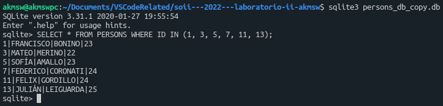

# Interprocess communication (2)

## Introduction
El presente es un trabajo práctico de laboratorio cuyo objetivo es el de extender la arquitectura cliente-servidor desarrollada en el laboratorio #1, capaz de soportar al menos tres protocolos distintos de la familia descripta en el header `<sys/socket.h>`, agregando soporte para comunicación con una base de datos.

## Startup
Para comenzar, se debe clonar el repositorio. Una vez hecho, podemos compilar todo el proyecto aprovechando el archivo makefile, con el comando:

`make all`

o, simplemente:

`make`

Esto compilará todo con las flags indicadas en la consigna:

`-Wall -pedantic -Werror -Wextra -Wconversion -std=gnu11`

Se organizó el proyecto en distintas carpetas para un mejor manejo de archivos. El código fuente en lenguaje C que engloba la resolución del trabajo se encuentra en la carpeta `src`. Los headers y cuerpos de las librerías utilizadas se encuentran en `src/include/headers` y `src/include/bodies` respectivamente.

Se crean carpetas adicionales para los archivos `.o`, `.a` y para los binarios ejecutables finales.

A continuación se proporciona una vista general de la organización de los archivos del proyecto:

\
*Figura 1: Esquema de la organización del proyecto*

>Para obtener información sobre cómo correr el programa, puede seguir leyendo este documento o ejecutar el cliente (o el servidor) con los parámetros `--help`, `-h` o `?` para desplegar el menú de ayuda.

## Development
### Database
Se trabajó con la librería [SQLite3](https://sqlite.org/index.html) para crear la base de datos y poder realizar las consultas.\
Se creó una base de datos sencilla, cuya estructura se muestra a continuación:

\
*Figura 2: Esquema de la base de datos creada*

Como se aprecia, la base de datos consta de dos tablas: una donde se cargará información aleatoria sobre datos de personas, y otra donde se registrarán sólo las queries válidas recibidas de los clientes de tipo B, y un mensaje indicador de descarga para los clientes de tipo C.

### Server
El servidor cumple los mismos requerimientos del laboratorio #1, a excepción del log de velocidades de conexión que no es requisito obligatorio para este laboratorio.\
Por otro lado, el servidor mantiene cinco conexiones con la base de datos desde su inicio, y se mantienen durante toda la ejecución del programa, hasta finalizar.\
Como se tienen sólo cinco conexiones a la misma base de datos, y podemos tener más de cinco clientes de distintos tipos corriendo al mismo tiempo realizando múltiples consultas, fue necesario hacer un correcto control de concurrencia, ya que estamos trabajando con muchos procesos hijos que necesitan acceder a la misma base de datos para leer/modificar su contenido, posiblemente al mismo tiempo. Para esto, y de acuerdo con la documentación de la librería SQLite3, se hizo uso de la función `sqlite3_open_v2` con la flag `SQLITE_OPEN_FULLMUTEX`, la cual abre la base de datos en modo serializado, lo cual garantiza que la base de datos puede ser usada de manera segura por múltiples hilos sin restricción alguna.\
De esta forma, cuando algún cliente requiere una conexión a la base de datos para realizar alguna query, el servidor le asigna una conexión de las cinco establecidas en un comienzo con una política de elección aleatoria. Si la conexión elegida está siendo utilizada, el cliente tendrá que esperar a que se libere dicha conexión. Luego, la query emitida por el cliente es procesada por el servidor, que la envía contra la base de datos y cuyo resultado le devuelve al usuario que la emitió, listo para mostrar en pantalla.\
Para levantar el servidor y esperar conexiones, el usuario debe ingresar los siguientes parámetros, en el orden en el que se los lista a continuación:

1. Nombre del archivo de socket utilizado para la comunicación TCP/IP local.
1. Puerto receptor de comunicaciones TCP/IPv4.
1. Puerto receptor de comunicaciones TCP/IPv6.

Una vez levantado el servidor, se podrán recibir conexiones de clientes de cualquiera de los protocolos de conexión listados.

### Clients
Se tienen tres tipos de clientes distintos:
- **Cliente A (conectado vía socket local)**: Envía una query custom constantemente, y muestra en pantalla el resultado. La query que se eligió para este cliente es: `SELECT * FROM PERSONS`.
- **Cliente B (conectado vía TCP/IPv4)**: Este cliente posee una CLI, donde el usuario puede ingresar la/las queries que desee enviar, y su resultado se mostrará en pantalla.
- **Cliente C (conectado vía TCP/IPv6)**: Este cliente descarga el archivo de la base de datos en el host local bajo un nombre que elija el usuario, recibido por parámetro.

A continuación se listan los parámetros necesarios para levantar un cliente de cada tipo:

- TCP/IP local:
  1. Protocolo utilizado ("local").
  1. Nombre del archivo de socket utilizado para la comunicación.
- TCP/IPv4:
  1. Protocolo utilizado ("ipv4").
  1. Address del servidor, en formato IPv4.
  1. Puerto del servidor al cual se conectará el cliente.
- TCP/IPv6:
  1. Protocolo utilizado ("ipv6").
  1. Address del servidor, en formato IPv6.
  1. Interfaz de comunicación para conexión IPv6 *(consultar comando ifconfig)*.
  1. Puerto del servidor al cual se conectará el cliente.
  1. Nombre con el que se guardará la copia del archivo de base de datos recibido por socket (debe tener especificada la extensión `.db`).

## Running
>Para obtener ejemplos sobre cómo correr el programa, puede seguir leyendo este documento o ejecutar el cliente (o el servidor) con los parámetros --examples, -e o ! para desplegar el menú de ejemplos.

A continuación se listan algunos ejemplos de ejecución, asumiendo que el proyecto fue compilado exitosamente y que el usuario se encuentra en la carpeta raíz del proyecto:

- Server:
  - `./bin/srv my_socket 2222 5000`
- Client:
  - `./bin/cln local my_socket`
  - `./bin/cln ipv4 localhost 2222`
  - `./bin/cln ipv4 [$HOSTNAME] 2222`
  - `./bin/cln ipv4 127.0.0.1 2222`
  - `./bin/cln ipv4 [IPv4 address] 2222`
  - `./bin/cln ipv6 ::1 lo 5000 db_copy.db`
  - `./bin/cln ipv6 [IPv6 address] enp39s0 5000 db_copy.db`

Se proveen tres bashscripts dentro de la carpeta `scripts` para instanciar más de un cliente de un mismo tipo a la vez. Para utilizarlos, el usuario debe estar posicionado en la carpeta root del proyecto. Estos scripts pedirán los mismos parámetros que se solicitan para instanciar un solo cliente y el número de clientes a crear.

## Testing
Para poner a prueba el proyecto, se realizaron consultas de tipo `SELECT`, `INSERT` y `DELETE` en ambas tablas con clientes de tipo B, se transfirió mediante el socket TCP/IPv6 la base de datos con distintos nombres, y se corrieron múltiples instancias de todos los clientes al mismo tiempo para corroborar el correcto manejo de concurrencia.

## Screenshots
\
*Figura 3: Instancia de cliente B corriendo múltiples tests con queries de distintos tipos en ambas tablas.*

\
*Figura 4: Instancia de cliente A ejecutada durante un período de tiempo, y luego terminada con SIGINT.*

\
*Figura 5: Instancia de cliente C ejecutada.*

\
*Figura 6: Copia de la base de datos realizada con éxito.*

\
*Figura 7: Corroboración del correcto funcionamiento de la copia de la base de datos hecha con el cliente de tipo C.*

\
*Figura 8: Corroboración del correcto registro de la transferencia del archivo vía socket IPv6 en la tabla correspondiente en la base de datos.*

## Known issues
- Dado que se registran las queries de notificación de descarga luego de que los clientes de tipo C reciban una copia del archivo de base de datos, los tests con `md5sum` o `shasum` no darán iguales aunque la copia sea totalmente funcional.